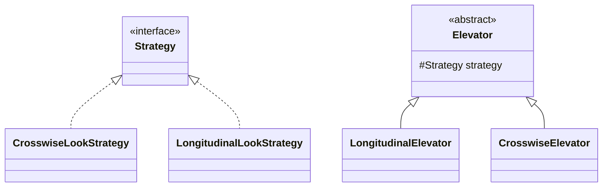

**纵向Look**

* **电梯运行方向（初始方向向上）：**

  * 电梯中有乘客时：为电梯中乘客的目的地方向
  * 电梯中没有乘客时：如果在当前方向上电梯外部（包括当前层）有请求，则电梯保持原方向不变，反之则调转方向

* **电梯接人策略：**

  只接目的地与电梯当前运行方向相同的外部乘客

**横向Look（记A、B、C、D、E座编号为0、1、2、3、4）**

**乘客目的方向**为能够完成这个请求的最短路线所走的方向

* **电梯运行方向：**
  * 当电梯中有乘客时：为电梯中乘客目的地的方向
  * 电梯中没有乘客时：仍然按照纵向的策略寻找，纵向的上限与下限为$10$和$1$，横向为$(now + 2) \% 5$和$(now+3)\%5$，查看当前方向上（包括当前层）是否有请求，如果有则电梯方向保持不变，反之则调转
* **电梯接人策略：**
  * **如果当前电梯中没人且当前座外部没有当前同方向的请求但是有当前反方向的请求，那么电梯接人!!!**
  * 其它情况只接目的方向与电梯当前运行方向相同的外部乘客

