# BUAA OO Unit3 总结

[toc]

本单元是通过给出用 ``JML``语言描述的规格从而实现一个社交网络系统，按规格实现基本没有什么难度，不过如果完全按照规格来写绝对会 ``TLE``，所以要优化，而优化方面采用的算法以及技巧由于都接触过很多次所以也没有什么难度

## 作业思路 

### 架构

* 本单元架构方面非常简单，就是严格按照官方包中的要求**实现相应接口**，除了第三次作业新增实现相应接口的``MyRedEnvelopeMessage``，``MyNoticeMessage``，``MyEmojiMessage``类继承了``MyMessage``类，而没有重新实现一遍``Message``接口中的方法

* 当然除了按照官方接口实现类之外，我还**建立了一个``util``工具包**，用于放置一些写好的数据结构类，比如边表的节点``Edge``，并查集``DisjointSets``，最短路的$dis$节点``Node``

* 关于**容器的选择**，除``Person``中的``Messages``因为要按顺序插入读取用了``LinkList``（比``ArrayList``快一点），其余均采用了``HashMap``，其中``key``为``id``，``value``为类的引用（``Person``的``acquaintance``的``value``为该``Person``与对应``id``的``Person``之间的``value``）,主要考虑在于本单元作业主要在于查询与维护，而``HashMap``对键值操作大部分均为$O(1)$

* 关于**构建的图模型及维护策略**，维护策略非常简单就是用上述容器直接保存相应元素，当然还有运用并查集维护连通分量

  而图模型从整体上看，``MyNetWork``中保存了图中所有节点（``Person``），而每个``Person``所保存的``acquaintance``构成了一个邻接表，图中元素储存在对应层次的容器中

### 类图

由于此次每个类的方法属性基本由规格给出，非常清晰，实现的每个类中我基本上没有人为添加任何方法、属性（除为追求速度的一些刻意维护，如缓存最小生成树），因此简单给出本单元类的结构关系

```mermaid
classDiagram
class Message {
	<<interface>>
}
class NoticeMessage {
	<<interface>>
}
class RedEnvelopeMessage {
	<<interface>>
}
class EmojiMessage {
	<<interface>>
}
class MyMessage {
	
}
class MyNoticeMessage {
	
}
class MyRedEnvelopeMessage {
	
}
class MyEmojiMessage {
	
}
class Group {
	<<interface>>
}
class MyGroup {
	
}
class Person {
	<<interface>>
}
class MyPerson {
	
}
class NetWork {
	<<interface>>
}
class MyNetWork {
	
}
class MainClass {
	
}
class Runner {
	
}
NetWork <|..MyNetWork
Group <|..MyGroup
Person <|..MyPerson
Message <|..MyMessage
Message <|--RedEnvelopeMessage
Message <|--NoticeMessage
Message <|--EmojiMessage
RedEnvelopeMessage <|..MyRedEnvelopeMessage
NoticeMessage <|..MyNoticeMessage
EmojiMessage <|..MyEmojiMessage
MyMessage <|--MyRedEnvelopeMessage
MyMessage<|--MyNoticeMessage

MyMessage<|--MyEmojiMessage
class DisjointSets {
	
}
class Edge {
	
}
class Node {
	
}

class EmojiIdNotFoundException {
	<<interface>>
}
class GroupIdNotFoundException {
	<<interface>>
}
class PersonIdNotFoundException {
	<<interface>>
}
class RelationNotFoundException {
	<<interface>>
}
class MessageIdNotFoundException {
	<<interface>>
}
class EqualEmojiIdException {
	<<interface>>
}
class EqualGroupIdException {
	<<interface>>
}
class EqualPersonIdException {
	<<interface>>
}
class EqualRelationException {
	<<interface>>
}
class EqualMessageIdException {
	<<interface>>
}
class MyEmojiIdNotFoundException {
	
}
class MyGroupIdNotFoundException {
	
}
class MyPersonIdNotFoundException {
	
}
class MyRelationNotFoundException {
	
}
class MyMessageIdNotFoundException {
	
}
class MyEqualEmojiIdException {
	
}
class MyEqualGroupIdException {
	
}
class MyEqualPersonIdException {
	
}
class MyEqualRelationException {
	
}
class MyEqualMessageIdException {
	
}
EmojiIdNotFoundException <|..MyEmojiIdNotFoundException
GroupIdNotFoundException <|.. MyGroupIdNotFoundException
PersonIdNotFoundException <|.. MyPersonIdNotFoundException
RelationNotFoundException <|.. MyRelationNotFoundException
MessageIdNotFoundException <|.. MyMessageIdNotFoundException
EqualEmojiIdException <|.. MyEqualEmojiIdException
EqualGroupIdException <|.. MyEqualGroupIdException
EqualPersonIdException <|.. MyEqualPersonIdException
EqualRelationException <|.. MyEqualRelationException
EqualMessageIdException <|.. MyEqualMessageIdException
```



## 性能

### 第九次作业

* ``query_circle(qci)``:可以通过并查集维护连通分量，从而直接查询从而实现均摊$O(1)$的复杂度，只使用路径压缩最坏情况下复杂度为$O(mlogn)$，平均复杂度为$O(m\alpha(m,n))$，只使用启发式合并，无论是按秩合并还是按一个连通分量中的节点数合并均为$O(mlogn)$，当然两个一起用其实并不会更快
* ``query_block_sum(qbs)``：在使用并查集维护连通分量的同时，还可以维护一个变量用于记录连通分量的个数实现$O(1)$复杂度，而如果按规格按规格则至少是$O(n^2)$的复杂度

### 第十次作业

* ``query_group_value_sum(qgvs)``:在加人删人以及**添加关系**时候动态维护，实现$O(1)$查询
* ``query_group_age_var(qgav)``:同样在加人删人时候动态维护 ``Group``内所有人的年龄和以及年龄平方和，利用如下公式实现$O(1)$查询：

  $$
  Var = \frac{\sum x^2-2\times mean\times\sum x +n\times mean^2}{n}
  $$
* ``query_least_connection(qlc)``:求查询人所处联通分量中的最小生成树大小，以关系 ``value``为边权，这里有两种算法，分别是$Kruskal$以及$Prim$：

  * $Kruskal$:使用$O(mlogm)$的排序算法以及复杂度为$O(m\alpha(m,n))$或者$O(mlogn)$的并查集，那么总的时间复杂度为$O(mlogm)$，值得注意的是本次作业中只在 ``Person``类中维护了邻接表，因此需要 ``dfs``转化它为边表，才可以使用该算法
  * $Prim$:一般采用堆优化后的$Prim$算法，复杂度为$O((n+m)logn)$，主要由两部分组成，首先是取出堆顶最小的点将其中一个端点加入集合$U$中$O(nlogn)$，然后是更新$U$到集合外点的最小距离集合，复杂度为$O(mlogn)$

  $Prim$适合稠密图（复杂度$O((n+m)logn)$），$Kruskal$适合稀疏图（复杂度为$O(mlogm)$，但一般还是用$Kruskal$，因为$Prim$本身常数也比较大，所以以下代码均基于$Kruskal$算法（主要是$Kruskal$实在太好写了，且第一次作业也实现了并查集类）

  最后介绍一波最阴间的优化——**缓存最小生成树**：

  注意这个最小生成树只有在有指令 ``ar``的时候才有可能改变，同时求一个 ``Person``的最小生成树等价于求并查集中它的父节点的最小生成树，可以开一个 ``HashMap<Person, Integer> cache ``储存每个 ``fa``以及它的最小生成树（第一次查询某个联通分量时计算然后记录）大小，同时再开一个 ``HashMap<Person, boolean> dirty``记录该最小生成树是否需要更新，注意并不是只要有 ``ar``操作就有最小生成树在之后查询中需要重新计算，有一种情况不用：在两个联通分量之间添加关系时，直接将它们的 ``fa``缓存的最小生成树相加在加上该关系的 ``value``，然后将该值更新为新联通分量（两个连通分量合并而得）中``fa``的最小生成树即可

### 第十一次作业

* ``send_indirect_message(sim)``:在一个连通分量中发送两个人之间消息时计算这两个人之间的最短路，还是两个算法$SPFA$，$Dijkstra$：

  * $SPFA$:和$Dijkstra$的区别在于可以支持对负权图的求解（但一定得有解，即不能存在负环），$Dijkstra$是用小根堆，每次取出$dis$最小的点，来更新距离，那么这个点来说，最小距离就是当前的$dis$。$SPFA$是用双端队列，每次取出队头，来更新距离，它之后可能还会入队。它是一种动态逼近法，因为每次松弛距离都会减小，所以松弛一定会有结束的。如果一个点入队超过$n$次就是存在负环。时间复杂度为$O(km)$（$k$为常数，$m$为边数，$n$为点数），最坏情况下复杂度为$O(nm)$
  * $Dijkstra:$不使用任何数据结构进行维护，每次松弛（对于$u$更新与它相连的所有$v$的$dis$）操作执行完毕后，直接在$S$集合中暴力寻找最短路长度最小的结点$O(n^2)$。松弛操作总时间复杂度为 $O(m)$，故全过程的时间复杂度为$O(n^2+m)=O(n^2)$ 。每成功松弛一条边$<u,v>$ ，就将$\{v,dis[v]\}$插入二叉堆中（如果$\{v,dis[v]\}$已经在二叉堆中，直接修改相应元素的权值即可），选择最小的$dis[i]$的操作直接取堆顶结点即可。共计 $O(m)$次二叉堆上的插入（修改）操作， $O(n)$次删除堆顶操作，而插入（修改）和删除的时间复杂度均为$O(logn)$ ，时间复杂度为 $O((n+m)logn)=O(mlogn)$。

  看时间复杂度都知道用哪个了，当然有个别情况其实$SPFA$更好一点点，当然就一点点。。。注意此次只用算两点间最短路，因此发现已经算出就直接返回就好

### 算法及数据结构

~~最后放点板子出来给下一届抄~~：

* $DisjointSets$（就我们这数据量递归是不可能爆栈的）:

  ```java
  public class DisjointSets {
      private final HashMap<Integer, Integer> fa = new HashMap<>();
      private final HashMap<Integer, Integer> rk = new HashMap<>();
      private int tot = 0;
  
      public void add(int x) {
          fa.put(x, x);
          rk.put(x, 1);
          tot += 1;
      }
  
      public int getTot() {
          return tot;
      }
  
      public int find(int x) {
          return fa.get(x) == x ? x : fa.merge(x, find(fa.get(x)), (a, b) -> b);
      }
  
      public void merge(int xx, int yy) {
          int fx = find(xx);
          int fy = find(yy);
          if (fx == fy) {
              return;
          }
          if (rk.get(fx) < rk.get(fy)) {
              fa.merge(fx, fy, (a, b) -> b);
          } else {
              fa.merge(fy, fx, (a, b) -> b);
              if (rk.get(fx).equals(rk.get(fy))) {
                  rk.merge(fx, 1, Integer::sum);
              }
          }
          tot -= 1;
      }
  
      public int getSize() {
          return fa.size();
      }
  
      public boolean contains(Integer x) {
          return fa.containsKey(x);
      }
  
  }
  ```
* $Kruskal$（``Edge``是自己写的一个类就$3$个属性$u$、$v$、$w$）:

  ```java
  // dsu为一个引用，每次执行qlc时候就new一个新的
  // dfs求边表
  private PriorityQueue<Edge> getEdges(PriorityQueue<Edge> edges, Person nxt, Person pre) {
      int uid = nxt.getId();
      if (dsu.contains(uid)) {
          return edges;
      }
      dsu.add(uid);
      Set<Map.Entry<Integer, Integer>> table = ((MyPerson)nxt).getAcquaintance().entrySet();
      for (Map.Entry<Integer, Integer> entry : table) {
          int vid = entry.getKey();
          if (pre == null || pre.getId() != vid) {
              edges.add(new Edge(uid, vid, entry.getValue()));
              getEdges(edges, people.get(vid), nxt);
          }
      }
      return edges;
  }
  
  private int Kruskal(PriorityQueue<Edge> edges) {
      int n = dsu.getSize() - 1;
      int min = 0;
      while (n > 0 && !edges.isEmpty()) {
          Edge edge = edges.poll();
          int u = edge.getUx();
          int v = edge.getVx();
          if (dsu.find(u) != dsu.find(v)) {
              n -= 1;
              dsu.merge(u, v);
              min += edge.getWx();
          }
      }
      return min;
  }
  ```
* $Dijkstra$:

  ```java
   private HashMap<Integer, Integer> getEdges(int id) {
       return ((MyPerson) getPerson(id)).getAcquaintance();
   }
  
  private int Dijkstra(int u, int v) {
      PriorityQueue<Node> q = new PriorityQueue<>(Comparator.comparingInt(Node::getDis));
      HashMap<Integer, Integer> dis = new HashMap<>();
      HashSet<Integer> in = new HashSet<>();
      dis.put(u, 0);
      q.offer(new Node(u, 0));
      while (!q.isEmpty()) {
          int s = q.poll().getId();
          if (!in.contains(s) && s != v) {
              in.add(s);
              HashMap<Integer, Integer> es = getEdges(s);
              int sw = dis.get(s);
              es.forEach((e, w) -> {
                  int ew = sw + w;
                  if (dis.getOrDefault(e, Integer.MAX_VALUE) > ew) {
                      dis.put(e, ew);
                      q.offer(new Node(e, ew));
                  }
              });
          } else if (s == v) {
              break;
          }
      }
      return dis.getOrDefault(v, Integer.MAX_VALUE);
  }
  ```

## 测试

### 自测bug

本单元自测时一共就一个 ``bug``，就是第二次的 ``qgav``的精度有问题，具体如下：

$$
Var = \frac{\sum x^2-2\times mean\times\sum x +n\times mean^2}{n}
$$

但是如果写成：

$$
Var = \frac{\sum x^2-2\times mean\times\sum x}{n}+mean^2
$$

或者：

$$
Var = \frac{\sum x^2}{n}-mean^2
$$

都会出现精度错误，原因在于 ``Java``计算整数除法时会得到一个整数省略小数部分，于是结果可能会有$1$的误差

### 自测方法

由于 ``Junit``效率太低并且也要自己写数据生成，于是采取写数据生成器和同学对拍的方法，其中第九，第十次作业采用随机数据就好，但是第十一次数据生成需要保证覆盖度于是需要维护整个图，以及其中的信息（``sim``，发送``EmoijMessage``总是测的不够强），还是挺花时间的，同时还要考虑所有异常是否都测到了，我本人也花了半个晚上修改数据生成器（对着生成的数据不断修改，每次都是$20$万条，眼睛都瞎了）。当然本单元还有一个问题是程序运行时间测不准的毛病，而 ``PyCharm``的终端无法测准，为了测准时间其中具体实现如下：

```python
'''
				PARAMETER
	src_list: 储存jar包名字的列表，无需后缀.jar
	num: 第num组数据
	time_limit: 运行时限

				TIPS 
	需要提前将生成的数据存储在input.txt中
'''
def test(src_list: list, num: int, time_limit: float) -> None:
    print('----- TEST CASE ' + str(num) + ' BEGIN -----')
    print('           TIME')
    for src in src_list:
        os.environ["COMSPEC"] = 'powershell'
        p = subprocess.Popen(
            'Measure-Command{Get-Content input.txt | java -jar ' + src + '.jar > ' + src + '.txt}',
            shell=True, stdout=subprocess.PIPE)
        p.wait()
        time_list = p.stdout.read()
        sorted_list = time_list.decode('utf-8').strip().split('\n')
        time_used = float(sorted_list[9].split(": ")[1])
        print(src + ' used : ' + str(time_used) + 's')
        if time_used >= time_limit:
            print(src + ' is TLE')
            os.system('pause')
    print('          RESULT')
    pre = src_list[0]
    for i in range(1, len(src_list)):
        os.system('fc ' + pre + '.txt ' + src_list[i] + '.txt /n > result.txt')
        result = open('result.txt', 'r')
        result.readline()
        if 'FC' not in result.readline():
            print(src_list[i] + ' is different with ' + pre)
            os.system('pause')
        pre = src_list[i]
    print('  All answers are identical')
    print('------ TEST CASE ' + str(num) + ' END ------\n\n')
```

在我的数据生成器下，本单元宿舍全员实现$0$``bug``，舍友 ``sjh``还实现了一个图形界面用于大家一起对拍：


## 评测

本单元强测互测均未出 ``bug``，中测都一遍过，互测中也尽力去 ``Hack``了，关于它人的 ``bug``：

### 第九次作业

* ``qbs``次数过多时 ``TLE``，原因在于没有在维护并查集的同时，维护连通块数量，有的人甚至没有用并查集

### 第十次作业

* ``qgav``的精度出错，没有考虑整数除法导致的精度损失问题
* ``qgvs``维护时出错，往组中加关系的时候要更新 ``qgvs``
* ``qgav``使用规格中的两重循环，导致 ``TLE``

### 第十一次作业

* ``qm``精度计算出错，往一个组中发 ``RedEnvelopeMessage``时要注意精度，按照规格就不会有问题

## 拓展

### 需求

假设出现了几种不同的 ``Person``

- ``Advertiser``：持续向外发送产品广告
- ``Producer``：产品生产商，通过 ``Advertiser``来销售产品
- ``Customer``：消费者，会关注广告并选择和自己偏好匹配的产品来购买 -- 所谓购买，就是直接通过``Advertiser``给相应 ``Producer``发一个购买消息
- ``Person``：吃瓜群众，不发广告，不买东西，不卖东西

如此 ``Network``可以支持市场营销，并能查询某种商品的销售额和销售路径等 请讨论如何对 ``Network``扩展，给出相关接口方法，并选择$3$个核心业务功能的接口方法撰写 ``JML``规格（借鉴所总结的 ``JML``规格模式）

### 接口方法

``Advertiser``，``Producer``，``Customer``都可以设计为``Person``子接口，``BuyingMessage``，``AdertiseMessage``可以设计为``Message``的子接口

* ``Advertiser``:
  * ``get*``等等
* ``Producer``（只能生产对应``id``的产品）:
  * ``get*``等等
* ``Customer``:
  * ``get*``等等
* ``MyNetWork``:
  * ``get*``，``add*``，``contains*``还有方法等等
  * ``queryProductSales``：查询对应``ProducerId``的产品的销售额
  * ``queryProductPath``：查询``ProducerId``的产品的所有销售路径
  * ``buyProduct``:``Customer``在发送成功对应``BuyingMessage``后可以买东西
  * ``sendBuyingMessage``:``Customer``向``Advertiser``发送购买需求（需求中产品一定和``Customer``的偏好匹配，同时``Customer``必须收到过该产品广告，否则失败），或者是向``Produce``发送``Advertiser``持有的``BuyingMessage``
  * ``sendAdvertiseMessage``:``Advertiser``向``Customer``发送广告
* 各种异常接口。。。

### ``JML``规格

* ``buyProduct``:

  ```java
  /*@ public normal_behavior
    @ requires (containsCustomer(id1) && containsProducer(id2) && num > 0 && ReadyToBuy(id1, id2));
    @ assignable getProducer(id2).sales, containsCustomer(id1).money;
    @ ensures getProducer(id2).sales == \old(getProducer(id2).sales) + getProducer(id2).productPrice * num;
    @ ensures getCustomer(id1).money == \old(getCustomer(id1).money) - getProducer(id1).productPrice * num;
    @ ensures \result == true;
    @ also
    @ public normal_behavior
    @ requires (containsCustomer(id1) && containsProducer(id2) && num < 0 && && ReadyToBuy(id1, id2));
    @ assignable \nothing;
    @ ensures \result == false;
    @ also
    @ public exceptional_behavior
    @ signals (CustomerIdNotFoundException e) !containsCustomer(id1));
    @ signals (ProducerIdNotFoundException e) (containsCustomer(id1) && !containsProducer(id2));
    @ signals (ProducerNotReadyToBuyException e) (containsCustomer(id1) && containsProducer(id2) && !ReadyToBuy(id1, id2));
    @*/
  public boolean buyProduct(int id1, int id2, int num) throws
      CustomerIdNotFoundException, ProducerIdNotFoundException, ProducerNotReadyToBuyException;
  ```

* ``sendAdvertiseMessage``:

  ```java
  /*@ public nomal_behavior
      @ requires containsMessage(id) && (getMessage(id) instance of AdvertiseMessage) && getMessage(id).getType() == 0 &&
      @          getMessage(id).getPerson1().isLinked(getMessage(id).getPerson2()) &&
      @          getMessage(id).getPerson1() != getMessage(id).getPerson2();
      @ assignable messages;
      @ assignable getMessage(id).getPerson2().messages;
      @ assignable getMessage(id).getPerson1().socialValue, getMessage(id).getPerson2().socialValue;
      @ ensures !containsMessage(id) && messages.length == \old(messages.length) - 1 &&
      @         (\forall int i; 0 <= i && i < \old(messages.length) && \old(messages[i].getId()) != id;
      @         (\exists int j; 0 <= j && j < messages.length; messages[j].equals(\old(messages[i]))));
      @ ensures \old(getMessage(id)).getPerson1().getSocialValue() ==
      @         \old(getMessage(id).getPerson1().getSocialValue()) + \old(getMessage(id)).getSocialValue() &&
      @         \old(getMessage(id)).getPerson2().getSocialValue() ==
      @         \old(getMessage(id).getPerson2().getSocialValue()) + \old(getMessage(id)).getSocialValue();
      @ ensures (\forall int i; 0 <= i && i < \old(getMessage(id).getPerson2().getMessages().size());
      @          \old(getMessage(id)).getPerson2().getMessages().get(i+1) == \old(getMessage(id).getPerson2().getMessages().get(i)));
      @ ensures \old(getMessage(id)).getPerson2().getMessages().get(0).equals(\old(getMessage(id)));
      @ ensures \old(getMessage(id)).getPerson2().getMessages().size() == \old(getMessage(id).getPerson2().getMessages().size()) + 1;
      @ also
      @ public normal_behavior
      @ requires containsMessage(id) && (getMessage(id) instance of AdvertiseMessage) && getMessage(id).getType() == 1 &&
      @           getMessage(id).getGroup().hasPerson(getMessage(id).getPerson1());
      @ assignable people[*].socialValue, messages;
      @ ensures !containsMessage(id) && messages.length == \old(messages.length) - 1 &&
      @         (\forall int i; 0 <= i && i < \old(messages.length) && \old(messages[i].getId()) != id;
      @         (\exists int j; 0 <= j && j < messages.length; messages[j].equals(\old(messages[i]))));
      @ ensures (\forall Person p; \old(getMessage(id)).getGroup().hasPerson(p); p.getSocialValue() ==
      @         \old(p.getSocialValue()) + \old(getMessage(id)).getSocialValue());
      @ ensures (\forall int i; 0 <= i && i < people.length && !\old(getMessage(id)).getGroup().hasPerson(people[i]);
      @          \old(people[i].getSocialValue()) == people[i].getSocialValue());
      @ also
      @ public exceptional_behavior
      @ signals (MessageIdNotFoundException e) !containsMessage(id);
      @ signals (NotAdvertiseMessageException e) containsMessage(id) && !(getMessage(id) instance of AdvertiseMessage);
      @ signals (RelationNotFoundException e) containsMessage(id) && (getMessage(id) instance of AdvertiseMessage) &&
      @          getMessage(id).getType() == 0 && !(getMessage(id).getPerson1().isLinked(getMessage(id).getPerson2()));
      @ signals (PersonIdNotFoundException e) containsMessage(id) && (getMessage(id) instance of AdvertiseMessage) &&
      @          getMessage(id).getType() == 0 && !(getMessage(id).getGroup().hasPerson(getMessage(id).getPerson1()));
      @*/
   public void sendAdvertiseMessage(int id) throws NotAdvertiseMessageException,
       MessageIdNotFoundException, RelationNotFoundException, PersonIdNotFoundException;
  ```

* ``queryProductSales``:

  ```java
  /*@ public normal_behavior
    @ requires containsProducer(id);
    @ assignable \nothing;
    @ ensures \result == getProducer(id).sales;
    @ also
    @ public exceptional_behavior
    @ signals (ProducerIdNotFoundException e) !containsProducer(id1));
    @*/
  public int queryProductSales(int id) throws
      ProducerIdNotFoundException;
  ```

  

## 心得体会与收获

* 学习了 ``JML``语言，契约式编程相关内容，第一次在完全给出规格情况下完成作业，这样的好处是怎么写都写不出 ``bug``因为需求实在是太明确了。但是缺点也有，就是个别方法的描述十分繁琐，中文描述可能$2$句说清楚，但是它要$20$行，比如 ``qlc``指令的官方描述，在没看中文指导书时，我花了快$20$分钟才知道这是一个求最小生成树的指令
* 每次作业我写的都不快，都在写完一遍后又反复对着 ``JML``语言描述检查，这也导致我本单元基本上是写完第一遍就是$0$``bug``的状态（除了第二次作业有个 ``qgav``精度问题）
* 这单元严格来说感觉只要一次作业就好了，没必要三次，因为后面两次一点难度都没有（第一次需要熟悉一下 ``JML``），像在考细心程度以及简单的算法，让我开始以如何把代码行数压到最少，如何写更快作为为目标，当然也因此学会了一点点的函数式编程技巧🐶🐶🐶
